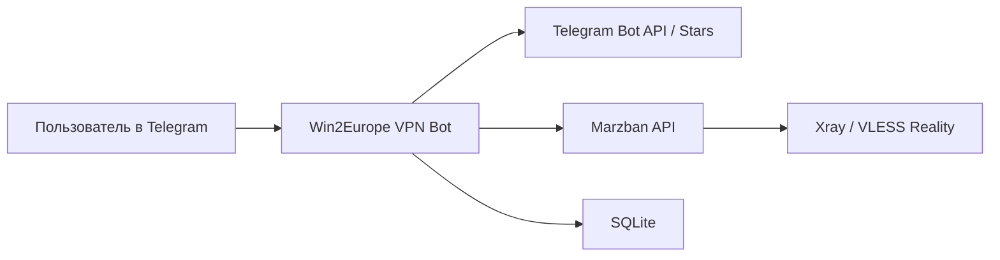

# Win2Europe VPN Bot

Telegram-бот для продажи VPN-подписок через **Telegram Stars** с автоматической выдачей **VLESS Reality**-ссылки и интеграцией с **Marzban**.

Проект решает полный пользовательский сценарий:

- показать тарифы в Telegram;
- принять оплату через Telegram Stars;
- создать или продлить доступ в Marzban;
- выдать готовую `vless://` ссылку для подключения;
- показать статус подписки;
- обработать запрос на возврат средств;
- автоматически отключить просроченный доступ.

## Что уже реализовано

- Оплата подписки через **Telegram Stars**
- Интеграция с **Marzban API**
- Автоматическая генерация **VLESS Reality**-ссылки
- Команды и кнопки для клиента:
  - `/start`
  - `/plans`
  - `/myvpn`
  - `/support`
  - `/refund`
- Постоянное нижнее меню в Telegram
- Автоматическое продление существующей подписки
- Фоновая проверка истекших подписок
- Запрос возврата средств из бота
- Одобрение/отклонение возврата админом прямо в Telegram
- Возврат через Telegram Bot API `refundStarPayment`
- Локальное хранение данных в SQLite
- Готовый пример `systemd`-сервиса для VPS

## Технологии

- Python 3.11+
- [aiogram 3](https://github.com/aiogram/aiogram)
- Marzban
- SQLite
- Telegram Bot API
- Telegram Stars
- VLESS TCP Reality

## Архитектура



## Основной пользовательский сценарий

1. Пользователь открывает бота и смотрит тарифы.
2. Выбирает план и оплачивает его в Stars.
3. Бот получает подтверждение оплаты.
4. Бот создает или продлевает пользователя в Marzban.
5. Бот отправляет готовую `vless://` ссылку.
6. Пользователь импортирует ссылку в VPN-клиент.

## Тарифы

В проекте используются три коммерческие линейки:

- `Basic` — 1 устройство
- `Plus` — 2 устройства
- `Family / Team` — 5 устройств

Поддерживаются периоды:

- 1 месяц
- 3 месяца
- 6 месяцев

### Важно

Сейчас **срок подписки ограничивается технически**, потому что бот передает `expire` в Marzban.

Лимит **по количеству устройств пока не enforced на уровне отдельного device-slot механизма**. На текущем этапе это коммерческое позиционирование тарифов. Полноценное техническое ограничение устройств запланировано как следующий этап развития.

## Возвраты

В проекте реализована схема возврата **по запросу**, а не полностью автоматический возврат без проверки.

Как это работает:

1. Пользователь нажимает кнопку запроса возврата.
2. Бот создает заявку по последнему платежу.
3. Администратор получает уведомление в Telegram.
4. Администратор одобряет или отклоняет заявку кнопкой.
5. При одобрении бот вызывает `refundStarPayment`.
6. Доступ пользователя отключается.

Это снижает риск злоупотреблений и при этом оставляет понятный клиентский сценарий.

## Структура проекта

```text
back.py
.env.example
requirements.txt
DEPLOY.md
wintoeurope-bot.service.example
```

### Ключевые файлы

- [back.py](C:\Users\IDKov\OneDrive\Рабочий стол\win2europe-bot\back.py) — основной код Telegram-бота
- [`.env.example`](C:\Users\IDKov\OneDrive\Рабочий стол\win2europe-bot\.env.example) — шаблон переменных окружения
- [DEPLOY.md](C:\Users\IDKov\OneDrive\Рабочий стол\win2europe-bot\DEPLOY.md) — заметки по деплою
- [wintoeurope-bot.service.example](C:\Users\IDKov\OneDrive\Рабочий стол\win2europe-bot\wintoeurope-bot.service.example) — пример `systemd`-сервиса

## Локальный запуск

### 1. Установить зависимости

```bash
python -m venv .venv
. .venv/bin/activate
pip install -r requirements.txt
```

Для Windows:

```powershell
python -m venv .venv
.venv\Scripts\Activate.ps1
pip install -r requirements.txt
```

### 2. Создать `.env`

Скопируйте [`.env.example`](C:\Users\IDKov\OneDrive\Рабочий стол\win2europe-bot\.env.example) в `.env` и заполните реальные значения.

Минимально важные поля:

```env
BOT_TOKEN=
USE_MOCK_MARZBAN=0
MARZBAN_BASE_URL=http://127.0.0.1:8000
MARZBAN_USERNAME=
MARZBAN_PASSWORD=
MARZBAN_VLESS_INBOUND=VLESS TCP REALITY
VPN_ADDRESS=vpn.win2europe.xyz
VPN_PORT=443
VPN_SNI=www.microsoft.com
VPN_PUBLIC_KEY=
VPN_SHORT_ID=
VPN_FINGERPRINT=chrome
VPN_FLOW=xtls-rprx-vision
SUPPORT_URL=https://t.me/win2europe?direct
ADMIN_IDS=
```

### 3. Запустить бота

```bash
python back.py
```

## Деплой на VPS

Бот рассчитан на запуск как отдельный сервис рядом с Marzban.

Рекомендуемая структура:

```text
/opt/vpn-bot/
  back.py
  .env
  requirements.txt
  .venv/
```

Базовый сценарий:

1. Создать папку проекта на VPS
2. Поднять виртуальное окружение
3. Скопировать `back.py`, `.env`, `requirements.txt`
4. Установить зависимости
5. Подключить `systemd`-сервис
6. Запустить бота

Пример перезапуска:

```bash
systemctl restart vpn-bot.service
journalctl -u vpn-bot.service -n 50 --no-pager
```

## Хранение данных

Бот использует SQLite и создает локальные таблицы:

- `users`
- `orders`
- `payments`
- `refund_requests`

Это позволяет:

- не терять статус подписки между перезапусками;
- связывать оплату и пользователя;
- хранить историю платежей;
- отслеживать возвраты.

## Безопасность

В репозиторий **не должны попадать**:

- `.env`
- реальные токены бота
- реальные пароли Marzban
- реальные приватные ключи
- локальная база `.db`

Для этого в проекте уже есть [`.gitignore`](C:\Users\IDKov\OneDrive\Рабочий стол\win2europe-bot\.gitignore) и [`.env.example`](C:\Users\IDKov\OneDrive\Рабочий стол\win2europe-bot\.env.example).

## Ограничения текущей версии

- Проект пока хранится в одном основном файле `back.py`
- Технический лимит количества устройств еще не реализован
- Подписка выдается в формате `vless://`, а не через полноценный subscription endpoint
- Документация по деплою еще может быть дополнительно улучшена

## Почему проект заслуживает внимания

Это не учебный “бот с одной кнопкой”, а практический MVP/production-oriented сервис, который связывает:

- платежи Telegram;
- Telegram UX;
- серверную VPN-панель;
- выдачу реального доступа;
- поддержку и возвраты;
- фоновую автоматизацию.

Проект уже покрывает основную бизнес-цепочку цифрового VPN-сервиса от оплаты до выдачи доступа.

## Roadmap

- Вынести проект из одного файла в модули
- Реализовать полноценные device slots для тарифов по устройствам
- Добавить subscription endpoint вместо только `vless://`
- Улучшить админские инструменты
- Добавить тесты
- Улучшить документацию и CI

## Автор

Проект разработан и настроен как практический Telegram VPN-сервис под бренд **Win2Europe VPN**.

